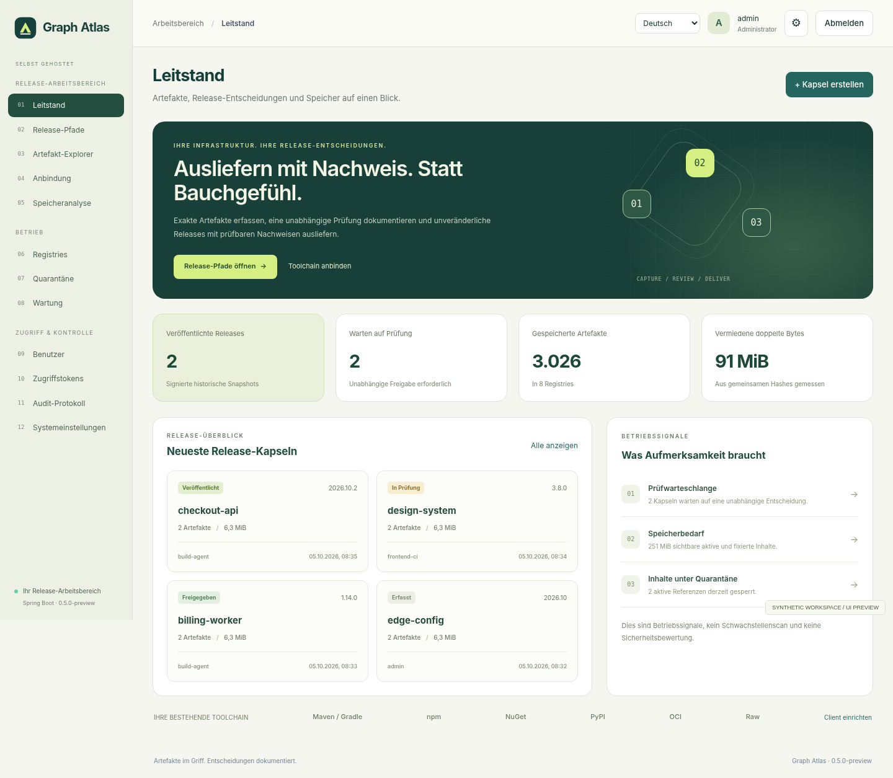

<div align="center">


# Graph Atlas

**Artefakte unter Kontrolle. Entscheidungen dokumentiert.**

Ein selbst gehosteter Arbeitsbereich für Artefakte und Releases auf Basis von Spring Boot.

[English](README.md) · [Produktüberblick](docs/de/product.md) · [Architektur](docs/de/architecture.md) · [Release-Nachweise](docs/de/release-assurance.md) · [Testnachweise](docs/de/testing.md)

</div>



## Vom Build zur nachvollziehbaren Freigabe

Ein gespeichertes Paket beantwortet noch nicht, welche konkreten Dateien geprüft wurden, wer sie freigegeben hat und ob genau diese Bytes weiterhin verfügbar sind. Atlas verbindet diese Fragen in einem Ablauf: **erfassen → prüfen → veröffentlichen → verifizieren**.

Das Projekt besitzt eine eigenständige Paket-Engine und eine releaseorientierte Oberfläche. Es benötigt keinen fremden Repository-Server. Beim ersten Aufruf startet die Anwendung auf Englisch. Deutsch und Persisch sind enthalten; Persisch verwendet eine Rechts-nach-links-Darstellung.

**Version `0.5.0-preview` ist eine Quellcode-Vorschau für Entwicklung und kontrollierte Abnahme.** Kern und Hilfsprogramme wurden lokal getestet. Die vollständige Spring-Boot-Laufzeit wurde in der Bereitstellungsumgebung nicht gebaut. Das Archiv ist kein Nachweis für eine Sicherheitszertifizierung oder Produktionsfreigabe.

## Neue Funktionen

| Funktion | Implementiertes Verhalten |
| --- | --- |
| Release-Pakete, „Capsules“ | Explizite Dateien aus mehreren Registries werden in einem festen SHA-256-Manifest erfasst. Änderungen oder Löschungen am ursprünglichen Pfad verändern die Capsule nicht. |
| Freigabe durch ein anderes Konto | Der Ersteller kann seine eigene Capsule nicht freigeben, auch nicht als Administrator. Prüfende benötigen `read` und `approve` für jede beteiligte Registry. |
| Signierte Nachweise | Ein Ed25519-Schlüssel der Instanz signiert Manifest und Entscheidungshistorie. Die Offline-Prüfung verlangt einen separat vertrauenswürdig bezogenen Schlüsselfingerabdruck. |
| Aktuelle CI-Entscheidung | Eine tiefe Integritätsprüfung und ein Python-Client prüfen Status, Hashwerte und Quarantäne. Unklare Ergebnisse gelten nicht als Freigabe. |
| Digestweite Quarantäne | Administratoren setzen oder lösen eine begründete Sperre. Neue binäre Downloads mit diesem Digest werden sowohl über Paketprotokolle als auch über Capsule-Endpunkte blockiert. |
| Speicheranalyse | Berechtigungsbezogene Kennzahlen zu Referenzen, eindeutigen Bytes, Deduplizierung, gebundener Historie und Konfiguration. Keine erfundenen Sicherheitsbewertungen oder Kosteneinsparungen. |


Die Phasen stellen Freigabezustände dar. Sie **kopieren keine Pakete und übertragen keine formatspezifischen Metadaten** zwischen Registries. Das CI-Gate muss ausdrücklich eingebunden werden: Normale Paket-URLs verlangen nicht automatisch eine Release-Freigabe. Eine Quarantänesperre ist eine manuelle Entscheidung, kein Malware- oder Schwachstellenscan.

## Paketprotokolle

| Familie | Lokal gehostet | Proxy/Cache | Gruppe |
| --- | :---: | :---: | :---: |
| Maven, einschließlich Maven-Repositories in Gradle | Ja | Ja | Ja |
| npm | Ja | Ja | Ja |
| NuGet V3 | Ja | Ja | Ja |
| Python / PyPI | Ja | Ja | Ja |
| Raw-Dateien | Ja | Ja | Ja |
| Docker / OCI | Ja | Nein | Nein |

Die [Funktionsabdeckung](docs/de/coverage.md) beschreibt die Grenzen. Es gibt keine kommerziellen Zähler für Benutzer, Registries, Pakete, Gesamtvolumen oder tägliche Anfragen. Hardwarekapazität und konfigurierbare Schutzgrenzen gelten weiterhin.

## Bauen und starten

Vorausgesetzt werden ein vollständiges **JDK 25** und **Maven ab 3.6.3**. Das Projekt verwendet **Spring Boot 4.1.1**. Beim ersten Build benötigt Maven externe Abhängigkeiten aus Maven Central oder einem freigegebenen Mirror. Das Quellarchiv enthält keinen Offline-Abhängigkeitscache.

```bash
bash scripts/build.sh

export GR_HOME="$PWD/data"
export GR_PUBLIC_URL=http://localhost:8081
export GR_BIND=127.0.0.1
export GR_PORT=8081

bash scripts/run.sh
```

Die Oberfläche ist lokal unter `http://localhost:8081` erreichbar. Bei einem neuen Datenverzeichnis heißt das erste Konto `admin`; das generierte Kennwort steht in `data/admin.password`. Kennwort sicher verwahren und die Bootstrap-Datei anschließend entfernen. Für Erstellung und Prüfung getrennte Konten verwenden.

Aus Kompatibilitätsgründen heißt die ausführbare Datei weiterhin `dist/graph-repository.jar`. Auch Java-Paketnamen und `GR_`-Umgebungsvariablen bleiben stabil. PowerShell-Skripte, Dockerfile, Compose, systemd und ein Nginx-TLS-Beispiel sind enthalten. Details stehen im [Betriebshandbuch](docs/de/operations.md).

**Ein vorgebautes, verifiziertes Spring-Boot-JAR ist nicht enthalten.** `build.sh` führt `mvn clean verify` aus und kopiert das Archiv erst nach erfolgreichem Abschluss.

## Freigabe in CI prüfen

Ein Token mit Leserechten auf allen Quell-Registries wird im CI-Secret `GR_TOKEN` hinterlegt:

```bash
python scripts/release_gate.py \
  --base-url https://atlas.example.test \
  --release YOUR_RELEASE_UUID
```

Exitcode `0` bedeutet aktuell erlaubt, `1` ausdrücklich gesperrt und `2`, dass keine verlässliche Freigabe festgestellt werden konnte. HTTPS ist Pflicht; lokales HTTP muss ausdrücklich aktiviert werden. Weiterleitungen werden nicht verfolgt. Anschließend feste Capsule-Downloads verwenden und die Dateihashes prüfen. Die Gate-Entscheidung ist eine Momentaufnahme, keine dauerhafte Sperre gegen spätere Widerrufe.

Historische Nachweise lassen sich ohne laufenden Server und ohne Maven prüfen:

```bash
bash scripts/verify-evidence.sh release-evidence.json TRUSTED_PUBLIC_KEY_SHA256
```

Damit wird die Signatur geprüft, **nicht der aktuelle Widerrufsstatus, die heruntergeladenen Dateien, Rechtskonformität oder Schwachstellenfreiheit**. [Ablauf und Vertrauensmodell](docs/de/release-assurance.md).

## Tatsächlich durchgeführte Prüfungen

| Prüfung | Ergebnis |
| --- | --- |
| Java-Kern unter OpenJDK 21.0.11 | 216 erfolgreiche Prüfungen, davon 68 neue zu Releases und Quarantäne. |
| Frontend-Unit-Tests unter Node 22.16.0 | 31 erfolgreich. |
| Ausgelieferte UI in Chromium über eine synthetische HTTP-Brücke | 116 erfolgreiche Prüfungen. |
| CI-Gate-Client | 14 Tests gegen einen lokalen Testserver erfolgreich. |
| Eigenständige Nachweisprüfung | 4 Tests mit temporären echten Ed25519-Schlüsseln erfolgreich. |
| Offline-Wiederherstellung | 12 Tests einschließlich Erhalt der Schlüsseldatei erfolgreich. |
| Java-Syntaxanalyse | 73 Dateien analysiert; kein Spring-Kompilierungsnachweis. |

Die Umgebung blockierte direkte Browsernavigation. Cookie- und CSP-Verhalten sowie echte Spring-Anfragen wurden daher nicht durch die UI-Suite geprüft. Maven war nicht vorhanden. Vollständiger Spring-Boot-Build, Java 25, Docker, Windows, Sicherheitsprüfung und Lastfreigabe sind weiterhin unbestätigt. Alle Screenshots zeigen ausdrücklich gekennzeichnete synthetische Daten. Siehe [Testbericht](docs/de/testing.md).

## Architektur und Grenzen

Der Maven-Reaktor trennt `repository-core` und `repository-server`. Spring MVC, Spring Security und Actuator bilden die HTTP- und Anwendungsschicht. Der Kern enthält Protokolle, Identitäten, transaktionale Metadaten, SHA-256-Blobs und Freigaberegeln. Die UI nutzt native JavaScript-Module und lokale Sprachdateien ohne CDN-Laufzeitabhängigkeit.

Der Datenspeicher ist für eine einzelne Instanz ausgelegt; sein Metadatenindex liegt im Arbeitsspeicher. Tiefe Prüfungen lesen vollständige Blobs synchron unter der Datenspeichersperre und können Schreiboperationen verzögern. Capsules behalten ihre Dateien in jedem Zustand. Löschen, Ablaufregeln oder automatische Bereinigung der Capsule-Historie sind nicht implementiert.

HA, SSO/MFA, Mandantenfähigkeit, Objektspeicher, automatische Scans, Replikation und Docker-Proxy/Gruppen fehlen. Betriebssystem- und Kontoadministratoren bleiben vertrauenswürdige Stellen. Zwei Konten beweisen nicht zwei verschiedene Menschen. Vor dem Betrieb [Sicherheit](docs/de/security.md) und [Migration](docs/de/migration.md) lesen.

## Projektstruktur

```text
repository-core/          Paketprotokolle, Speicherung, Release-Regeln und Kryptografie.
repository-server/        Spring Boot, MVC, Security, Actuator und dreisprachige UI.
scripts/                  Build, Restore, Nachweisprüfung, CI-Gate und Quellpaketierung.
tests/                    Frontend, Hilfsprogramme, Browser-Fixtures und Abnahme-Harness.
examples/ci/              Vorlage für eine explizite, manuelle CI-Einbindung.
docs/en/ und docs/de/     Technische Anleitungen, Produktkonzept und Vermarktung.
.github/                 CI, Kandidatenpaketierung, Issue-Vorlagen und Abhängigkeitsupdates.
```

[Mitwirken](CONTRIBUTING.de.md) · [Sicherheitsrichtlinie](SECURITY.de.md) · [Änderungen](CHANGELOG.de.md) · [Veröffentlichung](docs/de/publishing.md) · [Vermarktung](docs/de/commercialization.md).

## Lizenz und Produktname

Die bestehende [MIT-Lizenz](LICENSE) und Urheberangabe bleiben erhalten. Kommerzielle Nutzung und Verkauf sind unter diesen Bedingungen möglich. Öffentlich verfügbarer MIT-Code begründet jedoch **keine Exklusivität für den Verkäufer**. Abhängigkeiten behalten ihre eigenen Lizenzen. „Graph Atlas“ ist ein Arbeitsname ohne abgeschlossene Markenprüfung oder behauptete Registrierung. Siehe [Markenleitfaden](docs/de/brand.md) und [Drittanbieterhinweise](THIRD-PARTY-NOTICES.de.md).
