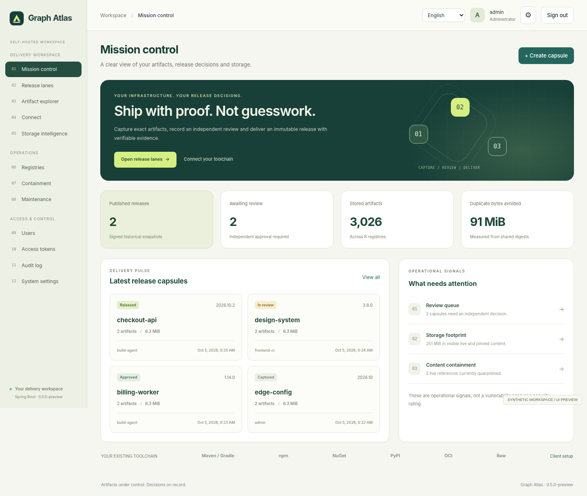
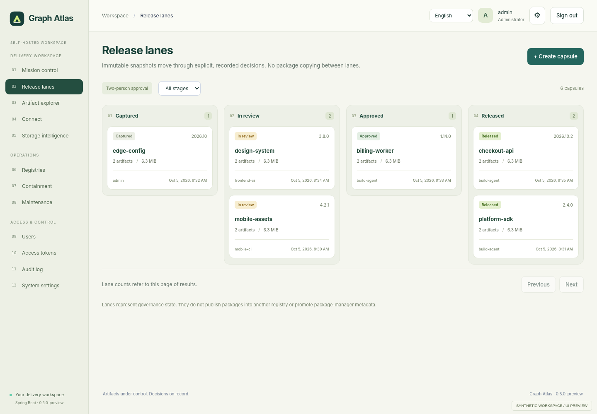

<div align="center">


# Graph Atlas

**Artifacts under control. Decisions on record.**

A self-hosted artifact and release workspace built with Spring Boot.

[Deutsch](README.de.md) · [Product tour](docs/en/product.md) · [Architecture](docs/en/architecture.md) · [Release assurance](docs/en/release-assurance.md) · [Test evidence](docs/en/testing.md)

</div>



## A workspace for the handover from build to release

Storing a package does not explain which exact files were reviewed, who approved them, or whether those bytes are still available. Atlas brings those questions into one workflow: **capture → review → release → verify**.

This is an independent implementation with its own package engine and a release-oriented interface. It does not connect to a third-party repository server. English is the first-run default; German and Persian are included, with right-to-left layout for Persian.

**Version `0.5.0-preview` is a source preview for development and controlled acceptance testing.** The Java core and tools have been exercised locally. The complete Spring Boot runtime has not been built in the delivery environment. Do not present this archive as a security-certified, production-qualified product.

## What is different in this release?

| Capability | Implemented behavior |
| --- | --- |
| Release capsules | Capture explicit files from several registries into a fixed SHA-256 manifest. Later replacement or removal of a live path does not change the capsule. |
| Independent-account approval | The author cannot approve their own capsule, including administrator authors. Reviewers need `read` and `approve` rights on every source registry. |
| Signed release evidence | An instance Ed25519 key signs the released manifest and decision history. An offline verifier requires a separately trusted public-key fingerprint. |
| Current CI decision | A deep verification endpoint and fail-closed Python client check current release state, hashes and containment. |
| Digest-wide containment | An administrator can place or resolve a reasoned hold. New binary reads for that digest are blocked through the shared protocol layer and frozen-release endpoints. |
| Storage intelligence | Permission-scoped live references, unique bytes, deduplication, pinned-only history and configuration signals. No invented security score or financial savings. |



The lanes describe governance states. They **do not copy packages or promote format-specific metadata** between registries. CI enforcement is opt-in: package-manager URLs do not automatically require release approval. A hold is an administrative decision, not malware or vulnerability detection.

## Package protocols

| Family | Hosted | Proxy/cache | Group |
| --- | :---: | :---: | :---: |
| Maven, including Gradle's Maven repository support | Yes | Yes | Yes |
| npm | Yes | Yes | Yes |
| NuGet V3 | Yes | Yes | Yes |
| Python / PyPI | Yes | Yes | Yes |
| Raw files | Yes | Yes | Yes |
| Docker / OCI | Yes | No | No |

See [the exact coverage and boundaries](docs/en/coverage.md). No commercial counters limit users, registries, package count, stored bytes or daily requests. Physical resources and configurable request-safety controls still apply.

## Build and run

Use a full **JDK 25** and **Maven 3.6.3+**. The project pins **Spring Boot 4.1.1**. A first Maven build needs external dependencies from Maven Central or your approved mirror; this source archive is not an offline Maven cache.

```bash
bash scripts/build.sh

export GR_HOME="$PWD/data"
export GR_PUBLIC_URL=http://localhost:8081
export GR_BIND=127.0.0.1
export GR_PORT=8081

bash scripts/run.sh
```

Open `http://localhost:8081`. On a new data directory, the initial account is `admin` and its generated password is written to `data/admin.password`. Store the password securely, then remove that bootstrap file. Use separate accounts for authors and reviewers.

The executable remains `dist/graph-repository.jar` to preserve deployment-script compatibility; product branding is Graph Atlas. The Java package namespace and `GR_` environment variables also remain stable. Windows scripts, a Dockerfile, Compose, systemd and an Nginx TLS example are included. See [operations](docs/en/operations.md).

**No prebuilt, verified Spring Boot JAR is shipped.** `build.sh` executes `mvn clean verify` and only copies an archive after successful completion.

## Verify a release in your pipeline

Create a read-only token for the capsule's source registries. Put it in the CI secret `GR_TOKEN`, then invoke:

```bash
python scripts/release_gate.py \
  --base-url https://atlas.example.test \
  --release YOUR_RELEASE_UUID
```

Exit status is `0` for an allowed current decision, `1` for an explicit denial and `2` when approval cannot be established. HTTPS is required except for explicitly enabled loopback testing. Redirects are refused. Use pinned release downloads and verify their hashes before deployment; a passed gate is a point-in-time result, not an ongoing lock.

Historical evidence can be verified without a running server or Maven:

```bash
bash scripts/verify-evidence.sh release-evidence.json TRUSTED_PUBLIC_KEY_SHA256
```

This verifies a signature, **not current revocation, artifact bytes, legal compliance or a vulnerability assessment**. [Complete workflow and trust model](docs/en/release-assurance.md).

## Verification performed for this source delivery

| Executed check | Result |
| --- | --- |
| Java core on OpenJDK 21.0.11 | 216 checks passed, including 68 new release/containment checks. |
| Frontend unit checks on Node 22.16.0 | 31 tests passed. |
| Delivered UI in Chromium using a synthetic HTTP bridge | 116 checks passed. |
| Fail-closed CI client | 14 tests passed against a local test server. |
| Standalone evidence verifier | 4 tests passed with temporary real Ed25519 keys. |
| Offline restore helper | 12 tests passed, including signing-file preservation. |
| Java syntax parsing | 73 files parsed; this is not Spring compilation. |

Native browser navigation was blocked by the environment. Therefore cookie/CSP behavior and real Spring requests were **not** verified by the UI suite. Maven was unavailable, so full Spring Boot compilation, Java 25 execution, Docker, Windows, security assessment and load certification remain unverified. All screenshots contain synthetic data and are marked as previews. See [test report](docs/en/testing.md), not an implied CI badge.

## Architecture and limits

The Maven reactor separates `repository-core` from `repository-server`. Spring MVC, Spring Security and Actuator form the HTTP/application layer. The core owns protocols, identity, transactional metadata, SHA-256 blobs and release governance. The browser uses native JavaScript modules and local translation catalogs, without runtime CDN dependencies.

The store is single-node and its metadata index is memory-resident. Deep verification reads complete blobs synchronously under the store lock, so large checks can delay writes. All capsule states pin their files; this version has no capsule deletion, expiry or automatic history pruning.

HA, SSO/MFA, multi-tenancy, object storage, automated scanning, replication and Docker proxy/group are not implemented. Root-level operators and account administrators remain trusted. Two accounts do not prove two different humans. Read [security](docs/en/security.md) and [migration](docs/en/migration.md) before deployment.

## Repository guide

```text
repository-core/          Package protocols, storage, release rules and cryptography.
repository-server/        Spring Boot, MVC, Security, Actuator and three-language UI.
scripts/                  Build, restore, evidence verification, CI gate and source packaging.
tests/                    Frontend, tools, browser fixtures and acceptance harnesses.
examples/ci/              Explicit, manual CI integration template.
docs/en/ and docs/de/     Paired technical, product and commercialization guides.
.github/                 CI, candidate packaging, issue templates and dependency updates.
```

[Contributing](CONTRIBUTING.md) · [Security policy](SECURITY.md) · [Changelog](CHANGELOG.md) · [Publishing](docs/en/publishing.md) · [Commercialization plan](docs/en/commercialization.md).

## License and product identity

The existing [MIT license](LICENSE) and attribution are retained. Commercial use and sale are permitted subject to its terms; public MIT source is **not exclusive intellectual property for the seller**. Dependencies retain their own licenses. “Graph Atlas” is a working product name, not a trademark-cleared or registered name. See [brand guidance](docs/en/brand.md) and [third-party notices](THIRD-PARTY-NOTICES.md).
