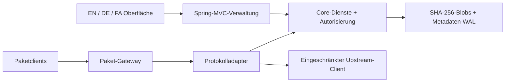

[English](../en/architecture.md) · [Deutsch](../de/architecture.md) · [Documentation](index.md)

# Architektur

## Module und Abhängigkeiten

`repository-core` enthält Speicherung, Identitäten, Autorisierung, Repository-Verwaltung und
Paketadapter. Es benötigt zur Laufzeit kein Spring. `repository-server` stellt die Spring-Boot-
Anwendung, MVC-Controller, Spring Security, Actuator und statische Ressourcen bereit.
Abhängigkeiten verlaufen vom Server zum Core, nicht umgekehrt.

Die vorhandene Domänen- und Protokolllogik ist in Spring integriert. Der frühere eigenständige
HTTP-Server läuft nicht als versteckter Dienst hinter einem Proxy-Controller weiter.

## Verarbeitung einer Anfrage

Die Browserverwaltung verwendet `/api/**`. Eine Sitzung authentifiziert den Benutzer;
verändernde Aktionen benötigen den konfigurierten Ursprung und ein CSRF-Token.
Explizite Basic-/Bearer-Zugangsdaten oder NuGet-API-Schlüssel werden getrennt verarbeitet.
Fehlerhafte explizite Zugangsdaten fallen nicht stillschweigend auf eine Browsersitzung zurück.

Paketverkehr verwendet `/repository/{name}/...` und `/v2/...`. Auf der Spring-Security-Ebene
sind diese Anfragen zustandslos. Das Core-Gateway prüft Online-Status, anonyme Leserechte sowie
read-/write-/delete-Berechtigungen. Veröffentlichungen in Proxy- oder Gruppen-Repositories
werden abgewiesen.

## Speichermodell

Binärdaten werden in SHA-256-adressierte Blobs gestreamt. Metadaten referenzieren den Digest,
statt für jede Referenz eine separate Datei zu duplizieren. Änderungen werden in einem
transaktionalen JSONL-Write-ahead-Log festgehalten; Snapshots ermöglichen eine Komprimierung.
Eine Prozesssperre schützt das Datenverzeichnis.

Der Metadatenindex liegt im Arbeitsspeicher. Der Verzicht auf kommerzielle Grenzen macht
diesen Index nicht horizontal skalierbar: RAM, Dateisystemleistung und Wiederanlaufzeit
bleiben praktische Grenzen. Mehrere Instanzen mit demselben Datenverzeichnis sind kein
unterstütztes Clusterkonzept.

## Grenze der Internationalisierung

Die Oberfläche übernimmt Darstellung und `Intl`-Formatierung. Sie übermittelt die gewählte
Sprache explizit als `Accept-Language`. `SupportedLanguages` im Core löst unterstützte Kennungen
unabhängig von der Sprache des Betriebssystems auf. Springs `MessageSource` liefert Fehlertexte
für MVC und die Sicherheitsfilter.

Übersetzt werden menschenlesbare Verwaltungsmeldungen. Protokollschlüssel, Ressourcenpfade,
Tokens, Hashes und gespeicherte Metadaten bleiben unverändert. Technische Fehlerdetails und
Diagnosen der Paketprotokolle bleiben Englisch.

## Beobachtbarkeit und Lebenszyklus

Spring steuert Start, geordnetes Herunterfahren und Offline-Wartungsbefehle. Health und Metriken
beschreiben die einzelne laufende Instanz. Anfrage-IDs verbinden Antworten mit Audit- und
Serverprotokollen. Öffentliche Health-Antworten bleiben knapp; detaillierte Verwaltungsendpunkte
benötigen Administratorrechte.

## Aufbau der Oberfläche

`app.js` enthält Ansichten und Formularabläufe. `i18n.js` übernimmt Sprachauswahl, Fallback,
Speicherung, Formatierung und Schreibrichtung. `client-examples.js` erzeugt maskierte,
formatspezifische Konfigurationsbeispiele. Die drei JSON-Kataloge besitzen identische Schlüssel.
Für den Betrieb ist weder ein Frontend-Paketmanager noch ein CDN erforderlich.

Die Oberfläche verwendet Textmaskierung, logische CSS-Eigenschaften, beschriftete Felder,
sichtbare Fokuszustände, einen Sprunglink und ein mobiles Navigations-Overlay.
Diese Maßnahmen sind keine formale Zertifizierung der Barrierefreiheit.

## Atlas-Release-Modul

`repository-core/.../release` enthält sechs neue Komponenten: `ReleaseService`, `QuarantineService`, `StorageInsightsService`, `EvidenceSigner`, `EvidenceEnvelope` und `EvidenceVerifierMain`. `ReleaseController` bindet sie in Spring MVC und die bestehende Sicherheitsgrenze ein. `static/delivery.js` bildet den releaseorientierten Arbeitsbereich; vorhandene Administrationsmodule bleiben erhalten.

Zustandswechsel nutzen Datenspeichersperre und WAL-Updates. Manifestreferenzen werden bei Bereinigung und Wartungsprüfung berücksichtigt. `ProtocolIO.asset` prüft Digest-Sperren vor binären Antworten, auch bei bedingten und Range-Anfragen. Übliche Repository-Rechte bleiben erforderlich.

Speicheraggregation vermeidet einen vollständigen Dateiscan je Registry und arbeitet linear über sichtbare Referenzen und konfigurierte Registries. Tiefe Integritätsprüfung bleibt synchron und kann Schreibzugriffe verzögern. Ein Durchsatzbenchmark wird nicht behauptet. Signaturen nutzen Java Ed25519 statt eines entfernten Signierdienstes.

Neue Metadatentabellen heißen `releases` und `holds`. Vor einem Downgrade [Migration](migration.md) lesen. Mehrknoten- oder Mandantenkonsistenz sind nicht implementiert.
