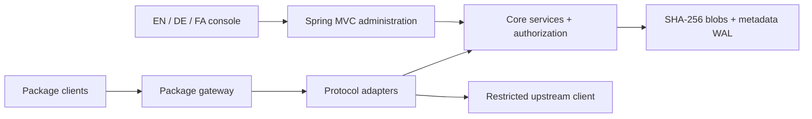

[English](../en/architecture.md) · [Deutsch](../de/architecture.md) · [Documentation](index.md)

# Architecture

## Modules and dependencies

`repository-core` contains storage, identity, authorization, repository administration and
package adapters. It has no Spring runtime dependency. `repository-server` provides the
Spring Boot application, MVC controllers, Spring Security, Actuator and static resources.
Dependencies point from the server to the core, not the other way around.

The existing domain/protocol code is retained and integrated with Spring, rather than
running the older standalone HTTP server behind a reverse-proxy controller.

## Request flow

Browser administration uses `/api/**`. A session authenticates the user; unsafe actions require
the configured origin and CSRF token. Explicit Basic/Bearer or NuGet API-key credentials are
handled separately and do not silently fall back to an existing browser session.

Package traffic uses `/repository/{name}/...` and `/v2/...`. These requests are stateless at
the Spring Security layer. The core gateway enforces the repository's online state,
anonymous-read policy and read/write/delete permissions. Proxy/group publication is rejected.

## Storage model

Binary content is streamed into SHA-256-addressed blob storage. Metadata references the content
digest rather than duplicating a separate file for every reference. Transactional metadata is
recorded in a JSONL write-ahead log, with snapshots for compaction. A single-process lock
protects the data directory.

The metadata index is in memory. Removing commercial limits does not make the index horizontally
scalable: RAM, filesystem performance and recovery time remain practical constraints.
Running multiple instances against the same directory is not a supported cluster design.

## Internationalization boundary

The console owns UI presentation and `Intl` formatting. It sends the selected language explicitly
through `Accept-Language`. Core `SupportedLanguages` resolves the supported tag independently
of the host locale. Spring `MessageSource` supplies error messages for MVC and security filters.

Only human-facing administrative messages are localized. Protocol keys, resource paths, tokens,
hashes and stored metadata are not rewritten. Technical error detail and package-protocol
diagnostics stay in English.

## Observability and lifecycle

The Spring application controls startup, graceful shutdown and offline maintenance commands.
Health and metrics describe the single running instance. Request IDs connect responses to audit
and server logs. Public health responses must remain minimal; detailed management endpoints
require administrator authorization.

## Frontend structure

`app.js` implements views and form workflows. `i18n.js` handles selection, fallback, persistence,
formatting and document direction. `client-examples.js` produces escaped, format-aware setup
examples. The three JSON catalogs have identical keys. No runtime frontend package manager or
CDN is required.

The console uses text escaping, logical CSS properties, labeled controls, visible focus states,
a skip link and a mobile navigation overlay. Accessibility improvements are implemented
features, not a formal accessibility certification.

## Atlas release module

`repository-core/.../release` owns six new components: `ReleaseService`, `QuarantineService`, `StorageInsightsService`, `EvidenceSigner`, `EvidenceEnvelope` and `EvidenceVerifierMain`. `ReleaseController` exposes the services through the existing Spring Security and MVC boundary. `static/delivery.js` contains the release-oriented workspace; the existing administration modules remain.

State transitions use the existing store lock and WAL-backed updates. Manifest references participate in garbage collection and maintenance verification. `ProtocolIO.asset` consults digest holds before binary responses, including conditional and ranged requests. The caller still needs normal repository permissions.

Storage aggregation is linear over visible asset references plus configured registries; it avoids a full asset rescan for every registry. Deep integrity verification is intentionally synchronous and can delay writes. No throughput benchmark is claimed. Signature verification is portable Java Ed25519, not a remote signing service.

These changes extend local metadata with `releases` and `holds`. Read [migration](migration.md) before downgrading. There is no multi-node or tenant-consistency protocol.
